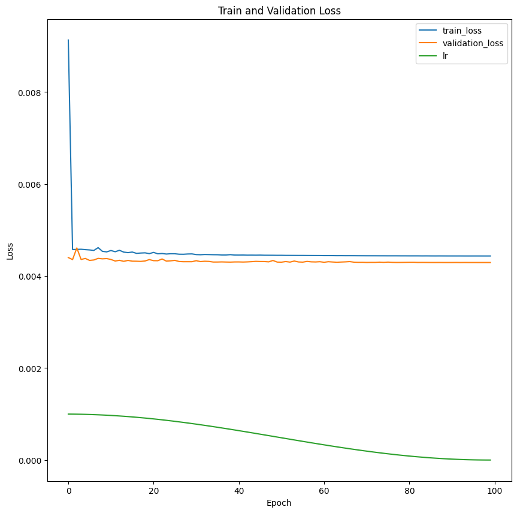
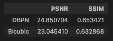
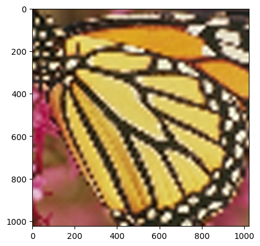
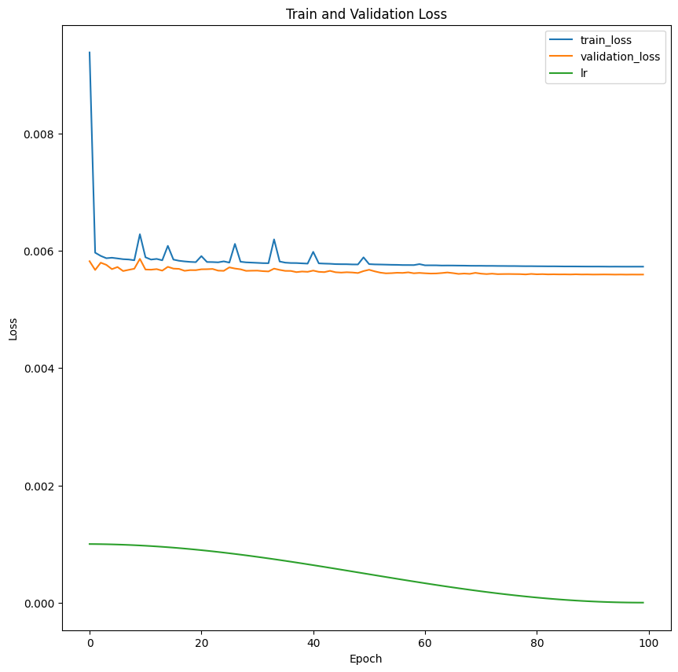
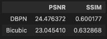
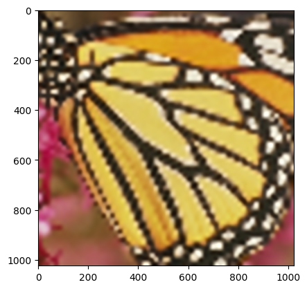

# DBPN

- ### DBPN-real-run-medium-dataset-no-noise.ipynb

- **Descrição**:

    Treinamento da DBPN com o dataset sem augmentation e sem noise.

- #### Dataset

  - **Train:**
    - path: ../datasets/TRAIN_Flick2k_DIV2K/_128_128_number=30
    - size:  Training set has 87539 instances
  - **Validation:**
    - path: ../datasets/VALIDATION_Flickr2K_DIV2K/_128_128_number=20
    - size: Validation set has 12592 instances

- #### Paths

  - **CSV:** ./dataframes/DBPN-real-run-medium-dataset-no-noise-cuda-0-epoch=0-99.csv
  - **Pesos:** ./trained_models/DBPN-real-run-medium-dataset-no-noise-cuda-0-epoch=0-99.pth

- #### Comentários

  - batch size: round(1*(2**6))

        ```py
        # The learning rate is initialized to 1e − 4 for all layers and decrease by a factor of 10 for every 5 × 105 iterations for total 106 iterations.
        lr = 1e-3
        model_betas = (0.9, 0.999)
        device = torch.device('cuda:0')

        # Total number of epochs
        epochs = 100

        model = DBPN(num_channels=3, base_filter=64,  feat = 256, num_stages=7, scale_factor=4).to(device)
        model_runner = ModelRunner()

        # For optimization, we use Adam with momentum to 0.9 and weight decay to 1e−4.
        optimizer = torch.optim.Adam(model.parameters(), lr=lr, betas=model_betas, weight_decay=1e-4)
        scheduler = torch.optim.lr_scheduler.CosineAnnealingLR(optimizer,
                                    T_max = epochs, # Maximum number of iterations.
                                    eta_min = 1e-6) # Minimum learning rate.
        ```

  - Learning rate:
  - Adam:
  - Dataset sem aumgmentation
  - Dataset sem noise
  - epochs: 100

##### Resultados

- Train and Validation Loss:
        

- Métricas:
        

- Exemplo:
     

---

- ### DBPN-real-run-medium-dataset-with-noise.ipynb

- **Descrição**:

    Treinamento da DBPN com o dataset sem augmentation e com noise de: AddGaussianNoise(0., 0.1),

- #### Dataset

  - **Train:**
    - path: ../datasets/TRAIN_Flick2k_DIV2K/_128_128_number=30
    - size:  Training set has 87539 instances
  - **Validation:**
    - path: ../datasets/VALIDATION_Flickr2K_DIV2K/_128_128_number=20
    - size: Validation set has 12592 instances

- #### Paths

  - **CSV:** ./dataframes/DBPN-real-run-medium-dataset-with-noise-cuda-1-epoch=0-99.csv
  - **Pesos:** ./trained_models/DBPN-real-run-medium-dataset-with-noise-cuda-1-epoch=0-99.pth

- #### Comentários

  - batch size: round(1*(2**6))

        ```py
        # The learning rate is initialized to 1e − 4 for all layers and decrease by a factor of 10 for every 5 × 105 iterations for total 106 iterations.
        lr = 1e-3
        model_betas = (0.9, 0.999)
        device = torch.device('cuda:0')

        # Total number of epochs
        epochs = 100

        model = DBPN(num_channels=3, base_filter=64,  feat = 256, num_stages=7, scale_factor=4).to(device)
        model_runner = ModelRunner()

        # For optimization, we use Adam with momentum to 0.9 and weight decay to 1e−4.
        optimizer = torch.optim.Adam(model.parameters(), lr=lr, betas=model_betas, weight_decay=1e-4)
        scheduler = torch.optim.lr_scheduler.CosineAnnealingLR(optimizer,
                                    T_max = epochs, # Maximum number of iterations.
                                    eta_min = 1e-6) # Minimum learning rate.
        ```

    - Learning rate: 1e-3 (CosineAnnealingLR) (T_max = 100, eta_min = 1e-6)
    - Adam:
    - Dataset sem aumgmentation
    - Dataset sem noise
    - epochs: 100

##### Resultados

- Train and Validation Loss:
        

- Métricas:
        

- Exemplo:
     

---

# SRCNN

- ### SRCNN_different_specs.ipynb

- **Descrição**:

    Treinamento da SRCNN com diferentes especificações.
    Nesse notebook foi aplicado a filtragem dos patches a partir de suas frequencias.
    Treinamos com f2 = 1 e f2 = 5

- #### Dataset

    (patches de 33 x 33)
  - **Train:**
    - path: ./datasets/Flickr2K_train
    - size:  Training set has 162186 instances
  - **Validation:**
    - path: ./datasets/Flickr2K_validation
    - size: Validation set has 53000 instances

- #### Paths

  - **CSV:** ./results/srcnn/dataframes/model_f2_5.csv
  - **Pesos:** ./results/srcnn/trained_models/model_f2_5.pth

- #### Comentários

    batch_size = round(0.35*(2**13))
  - batch size:

            ```py
            lr = 1e-3

            model_f2_5 = SRCNN(f2=5).to(device)
            optimizer_f2_5 = torch.optim.Adam(model_f2_5.parameters(), lr=lr)
            scheduler_f2_5 = torch.optim.lr_scheduler.LinearLR(
                optimizer_f2_5,
                start_factor=1.0,
                end_factor=0.01,
                total_iters=60)
            ```

    - Learning rate: 1e-3 (linear decay por 60 epochs com start_factor=1.0, end_factor=0.01)
    - Adam: lr=1e-3
    - Dataset sem aumgmentation
    - Dataset sem noise
    - epochs: 100
